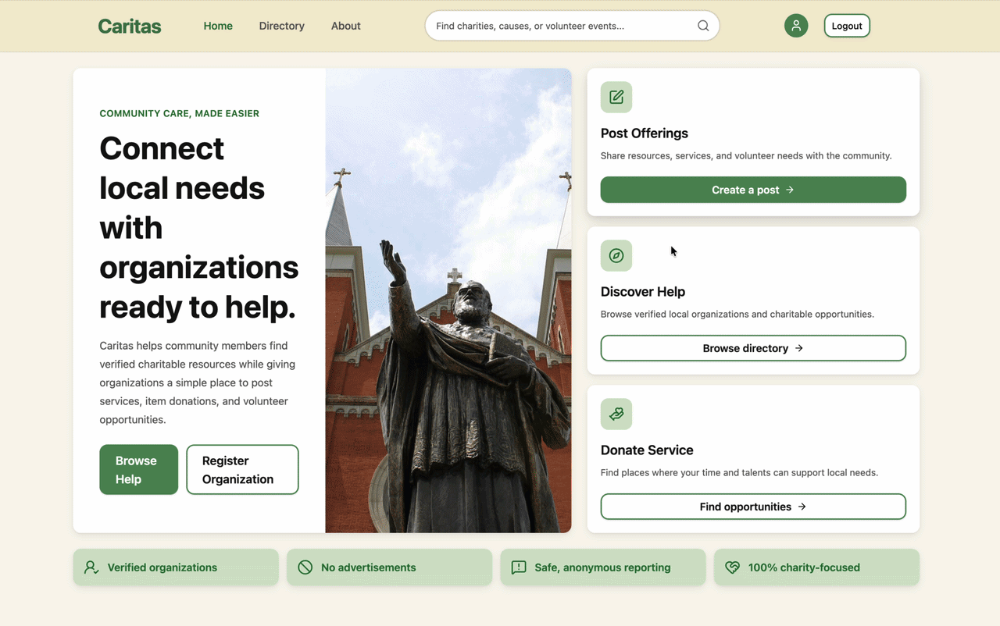
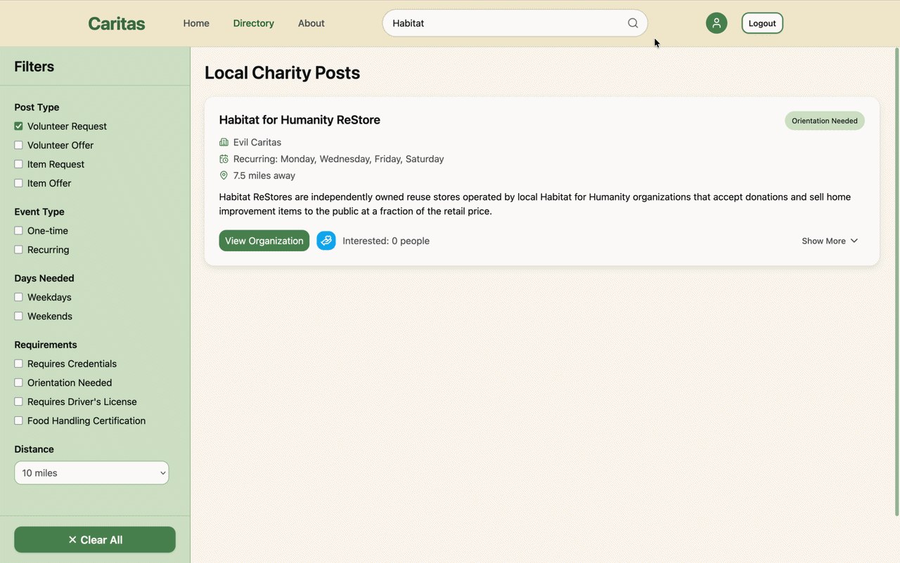

# Caritas

Charity & community service platform by Saint Vincent College CS Seniors designed to support and centralize interaction between community-based organizations, volunteers, and service recipients.

## Project Overview

Caritas transforms how charitable organizations and individuals connect by providing a dedicated, distraction-free platform. It allows verified charities to post local needs, manage volunteer opportunities, and offer resources without the algorithm-driven clutter of traditional social media. Users can browse and filter these opportunities completely account-free.

## Tech Stack

**Frontend:** React, TypeScript, Vite, Tailwind CSS
**Backend:** Node.js, Express, TypeScript
**Database & Search:** PostgreSQL, Redis (Caching), Meilisearch
**Authentication & Security:** Cloudflare Turnstile, JWT, bcrypt

## Key Features

- **Public Directory & Advanced Filtering:** Account-free browsing with dynamic filtering by distance, post type, recurrence, and specific requirements.
- **Interactive Mapping:** Integrated leaflet maps for location-based opportunity discovery.
- **Organization Dashboards:** Role-based access control (Admin/Member) for charities to manage team access, verify their status, and track post engagement.
- **Post Management System:** Full CRUD capabilities for organizations to request volunteers, offer items, or schedule recurring community events.




## System Architecture

The application follows a modular client-server architecture:

1. **Client-Side:** React-based single-page application handling complex state management for filtering and organization dashboards.
2. **Server-Side:** RESTful Node.js API managing business logic, rate limiting, and request validation.
3. **Data Layer:** PostgreSQL relational database supported by Redis for fast data retrieval and Meilisearch for highly optimized text and category querying.

# Getting Started

## Prerequisites

Before running Caritas locally, ensure you have the following installed:

- Node.js (v18+)
- PostgreSQL
- Redis
- Meilisearch

## Installation

### 1. Clone the Repository

```bash
git clone https://github.com/Yummypieisyummy/Caritas.git
cd Caritas
```

### 2. Install Dependencies

Install frontend dependencies:

```bash
cd frontend
npm install
```

Install backend dependencies:

```bash
cd ../backend
npm install
```

## Environment Variables

To run Caritas locally, create separate `.env` files for both the frontend and backend applications.

### Frontend Configuration

Create a `.env` file inside the `frontend` directory:

```env
# API Connection
VITE_API_URL=http://localhost:3001/api

# Security
VITE_TURNSTILE_SITEKEY=your_cloudflare_turnstile_site_key
```

### Backend Configuration

Create a `.env` file inside the `backend` directory:

```env
# Server Configuration
FRONTEND_URL=http://localhost:5173
PORT=3001

# PostgreSQL Database
POSTGRES_USER=your_postgres_user
POSTGRES_PASSWORD=your_postgres_password
POSTGRES_DB=your_postgres_database
POSTGRES_HOST=your_postgres_host

# Redis Cache
REDIS_URL=your_redis_connection_string

# Meilisearch
MEILISEARCH_URL=your_meilisearch_url
MEILISEARCH_AUTH=your_meilisearch_master_key

# Authentication & Security
ACCESS_TOKEN_SECRET=your_generated_access_secret
REFRESH_TOKEN_SECRET=your_generated_refresh_secret
VERIFICATION_TOKEN_SECRET=your_generated_verification_secret
TURNSTILE_SECRET=your_cloudflare_turnstile_secret

# Email Services
EMAIL_USER=your_smtp_email
EMAIL_PASS=your_smtp_password
RESEND_API_KEY=your_resend_api_key
```

## Running the Application

Once your environment variables are configured, start both development servers.

### Start the Backend

```bash
cd backend
npm run dev
```

### Start the Frontend

```bash
cd frontend
npm run dev
```

## Local URLs

After starting both servers:

- Frontend: `http://localhost:5173`
- Backend API: `http://localhost:3001`
